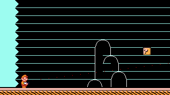

# Mari0 2

This is a prototype of a sequel to Mari0. The software would combine Super Mario Bros 3 with elements from the Portal franchise.

This fork is also a prototype, so it may undergo multiple iterations. Don't use it for production.

Check the [wiki](https://github.com/BrownieO/mari0-2/wiki) to get started.

Developed for LÖVE 11.5

## Additions
- 4 classic levels
- Python utilities
- New GUIs
- Damage and progression
- Bug fixes
- Basic documentation
- And more

## Credits

- Nintendo - Super Mario Bros 3 assets
- Maurice Guégan - Everything not listed somewhere else
- Hans Cárdenas - Mario sprites, title logo
- Technochips - Fixes
- BrownieO - Wiki, quick patches, utilities.
- awesomezack - P-Balloon sprites
- Alesan99 - Circle movement code
